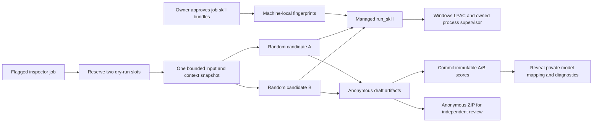

# Scoped draft reviews (0.99.95)

## 0.99.96 follow-up

Inspector job turns now receive their running job definition. `write_file` adds
only that job's current `job_access.grant_for` roots to its own artifact root.
Strict root validation checks the original spelling before path resolution can
erase a reparse point. Every call repeats grant verification and checked-path
validation, with exclusions for agent/realm state, memory, jobs, host control
trees and other agents. Writes use shared locks and atomic replacement, preserving
UTF-8 bytes/newlines so the 1 MiB limit is the actual file limit. `write_draft`
keeps its artifact-only boundary.

`notify_owner` accepts only text: no model-selected channel, recipient, attachment,
markup mode or Telegram chat link. Two valid attempts per turn are serialized
under the broker lock. Explicit delivery uses the host's linked Telegram sender;
external mute applies. If unlinked, the existing desktop channel applies its
machine/cross-realm switches and deduplication. Delivery failures are returned as
data, never provider exceptions. Desktop dispatch is not a display receipt.

Before final accounting, the coordinator seals the broker and snapshots successful
file writes plus exact notification text, timestamp, channel and delivery status.
Both the job report and transcript retain this audit on success, failure or Stop.
Host-recorded writes feed output capture and cross-agent artifact review, including
approved external paths. Inspector result validation admits those file roots but
does not execute live completion checks. No provider shell, web or live connector
is added, and production job/model changes remain owner actions.

`export_dry_run_pair(unpacked=true)` stages A/, B/ and comparison.json alongside
the atomic ZIP. ZIP and folder entries use the same anonymous bytes. A unique
final folder name preserves earlier exports; only a complete tree is renamed
into view. Exports remain ordinary review artifacts after pair retention.

The update ribbon independently remembers a dismissed version in browser-local
storage. Polling/navigation preserve it, later versions appear, and active update
progress/errors override dismissal. Settings retains its update action.

The following sections describe the 0.99.95 foundation, with these narrow
extensions superseding the original artifact-only inspector output scope.

This supersedes the agent-wide inspector behavior introduced in 0.99.93.
`is_inspector` plus the machine-local owner grant authorizes review access.
`job.inspector is True` selects it for a job turn. Chat, Inbox and other jobs retain
normal grants. TurnCoordinator wraps only the selected turn in ManagedTools;
normal MCP configuration and the capability preamble are omitted there. Context
compaction never receives inspection actions. Dry runs always receive the draft
broker, even when testing an inspector job. Inspection actions and script execution
are separate broker modes.

## File and execution boundary

`draft_inputs.freeze` copies approved realm/workspace/job inputs into the temporary
run tree before dispatch. Optional `dry_run_inputs` selects a narrower set. The
manifest maps original paths to staged files with SHA-256 hashes. Limits are
100 MiB / 10,000 files. Copying rejects links, detects size/mtime changes during
copy, and removes partial snapshots. Host control folders, runtime caches and
known credential paths are excluded. These exclusions are not a general-purpose
secret detector; owners still select appropriate business inputs.

`draft_skills` resolves only owning-agent or shared skill declarations included in
the job's allowed skill set. No search through other agents' folders. The owner
explicitly approves script entry points and every bundled file, including vendored
dependencies (20 MiB / 2,000 files). The fingerprint also binds job ID, prompt,
allowed skills and input selections. Approval and the saved job are rechecked for
each execution. Staged bundle hashes are checked again. Machine grants do not
travel with realm imports.

The managed `run_skill` API accepts a declared script and up to 32 text arguments.
The host selects the executable, interpreter flags and minimal environment.
Python receives its staged standard library and approved skill imports; Node.js
receives built-ins and its approved bundle. Neither inherits package-manager
installs, user startup hooks or provider/broker credentials. Embedded Python's
path file is rewritten to remove app/site-package hooks.

On Windows, a unique LPAC identity receives read/execute ACLs only on private
runtime, script and input copies, and modify ACLs only on output. Production ACLs
are never modified. No network capabilities are present, child creation is
restricted, and the container's external profile denies file writes. Node's
permission mode adds immediate child/API refusals. The launcher starts detached
and suspended: CREATE_NO_WINDOW would initialize a console host, which the child
restriction refuses. The existing supervisor assigns the process to a kill-on-close
Job Object before resuming it. Deadlines, output caps and cancellation retain the
same ownership semantics as other command processes. No unsupported-platform or
launch-error fallback uses an unrestricted process.

The 0.99.96 release gate also exposed a native exit race: `ExitProcess` can publish
code 0 while the process handle remains nonsignaled. Immediate tree termination
can then replace that code with 1. The sandbox wrapper now checks the process
signal with a zero-timeout wait before reading and caching the terminal exit code,
matching the standard subprocess wrapper. Native instrumentation reproduced the
premature code in all eleven runs and the false failure in the eleventh; the fix
retains the same job ownership, deadlines and isolation restrictions.
See Microsoft's [wait contract](https://learn.microsoft.com/en-us/windows/win32/api/synchapi/nf-synchapi-waitforsingleobject)
and [exit status reference](https://learn.microsoft.com/en-us/windows/win32/api/processthreadsapi/nf-processthreadsapi-getexitcodeprocess).

Scripts have 8 calls per turn, a maximum 120-second deadline, 4 MiB stdout and
1 MiB stderr bounds. Cancellation watches the parent session without replacing
its provider process handle. Broker expiry also requests script cancellation.
The MCP bridge/Codex tool timeout is 180 seconds. The existing user-approved
`dry_run_command` remains a trusted command contract, not this isolated API.

The AppContainer process/capability model and child policy were checked against
[Microsoft's launcher documentation](https://learn.microsoft.com/en-us/windows/win32/secauthz/implementing-an-appcontainer)
and [process attribute reference](https://learn.microsoft.com/en-us/windows/win32/api/processthreadsapi/nf-processthreadsapi-updateprocthreadattribute).
The Codex timeout field was checked against the
[official configuration reference](https://developers.openai.com/codex/config-reference).

## Blind pair state and retention

Pairs reserve both process-shared admission slots. Job definition and assembled
agent context are captured once. One input snapshot lives in
`.armada/dry-run-pairs/<pair>/inputs`; candidates retain the existing isolated
`.armada/dry-runs/<agent>/<job>/<run>/output` layout. Both brokers map original
input references to the same frozen bytes without a live fallback.

A/B assignments are random. The model/effort mapping is kept in machine config,
outside realm control trees. Original responses, telemetry and artifacts live in
its private `draft-comparisons` folder. Public run state omits actual model,
effort, capture/result details and tokens; usage reports label the candidate.
The inspector's generic artifact and input readers refuse host control paths.
Single-run review tools refuse paired candidates. Pair APIs withhold partial
files and reveal mapping/diagnostics only after both final scores are atomically
committed under the config lock. Scores are finite 0–100 and immutable after reveal.

Anonymous text masks exact selected model IDs/catalog labels; binary artifacts
are preserved. Self-authored binary metadata or writing style can suggest identity.
This enforces host metadata withholding, not information-theoretic blindness.
The export ZIP always excludes mapping, provider transcript and usage metadata,
including after reveal. Originals remain available privately for audit.

Housekeeping removes both candidates, the shared snapshot, private results and
mapping together after their captured retention period, only after both finish.
Exported ZIPs are ordinary inspector review artifacts and remain available.
Inspector calls are capped at four candidate launches per turn; a pair counts two.

## Validation

Synthetic tests cover per-turn grants, owner authority, effective inheritance,
effort override, script approval/revocation, bundle/path safety, frozen inputs,
admission, early-file withholding, score locking, anonymous export and retention.
Native Python and Node tests positively verify input reads/draft writes and
refused production access, input mutation, child creation and loopback network
access. Separate tests verify deadlines and cancellation. Actual Claude, Codex
and Gemini runs exercised both scripts and a refused production write. Native
Jobs/editor checks cover shared selectors, scope and explicit script approval at
desktop and narrow widths.
